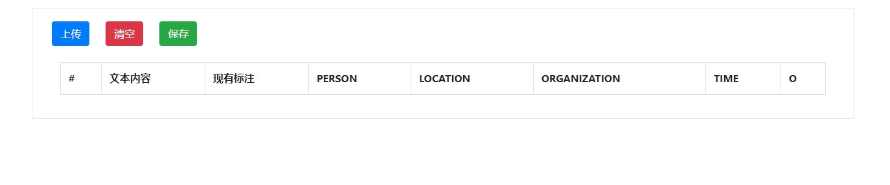
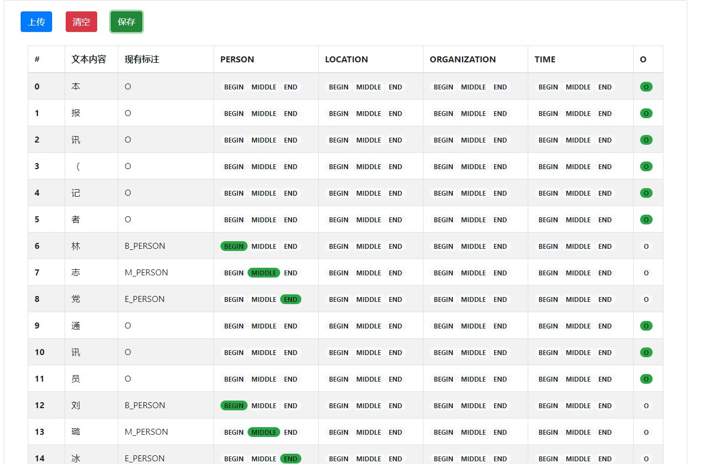

# NER_Helper

## 如何使用

1. 打开[demo](http://ner.youggls.top)可以看到如下所示网页

    

2. 点击上传按钮，上传本地NER文件

    

3. 上传完成后，可以点击相应的label进行标注。第四列到第八列为label对应的列，如果需要标注为其他标注，点击相应列中的label即可。如果我想把某个文字标注为`B_PERSON`，只需要点击PERSON列中的BEGIN即可。

4. 清空功能，如果发现上传错误或者是其他原因想要清空数据，点击红色的清空按钮即可。清空之前会提示是否清空。

5. 保存功能，标注完成后，点击保存按钮即可将文件保存至本地。文件名默认为原始文件名。
